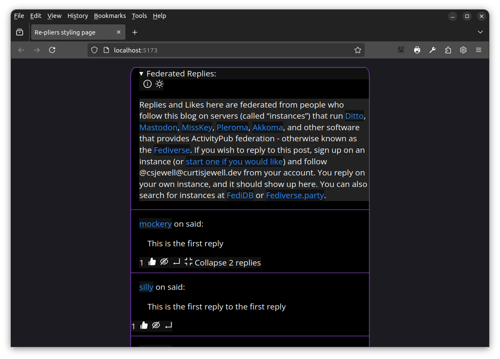

This module is used to provide a front end that blogs can use.

[](https://liberamanifesto.com)
[](https://git.sr.ht/~csjewell/fedi-any-page/tree/dev/item/docs/CODE_OF_CONDUCT.md)
[](https://git.sr.ht/~csjewell/fedi-any-page/tree/dev/item/LICENSES/MIT.txt)
[](http://commitizen.github.io/cz-cli/)

[](https://jsr.io/@csjewell-activitypub/re-pliers)
[](https://npmjs.com/package/@csjewell-activitypub/re-pliers)

This is a widget that can be put on blog pages to show ActivityPub replies.

It is currently being worked on heavily, but can be reviewed, especially for appearance. That
can be done because we are currently displaying a precomposed JSON file, instead of API calls,
right now.

## How it is looking

This is with some mock data:




## Usage

```html
<!-- TODO -->
```

## Development

See the documentation on [how to contribute](https://fedi-any-page.curtisjewell.dev/docs/contributing/).
Thanks! 💖

